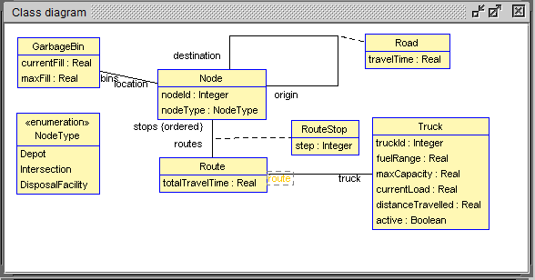
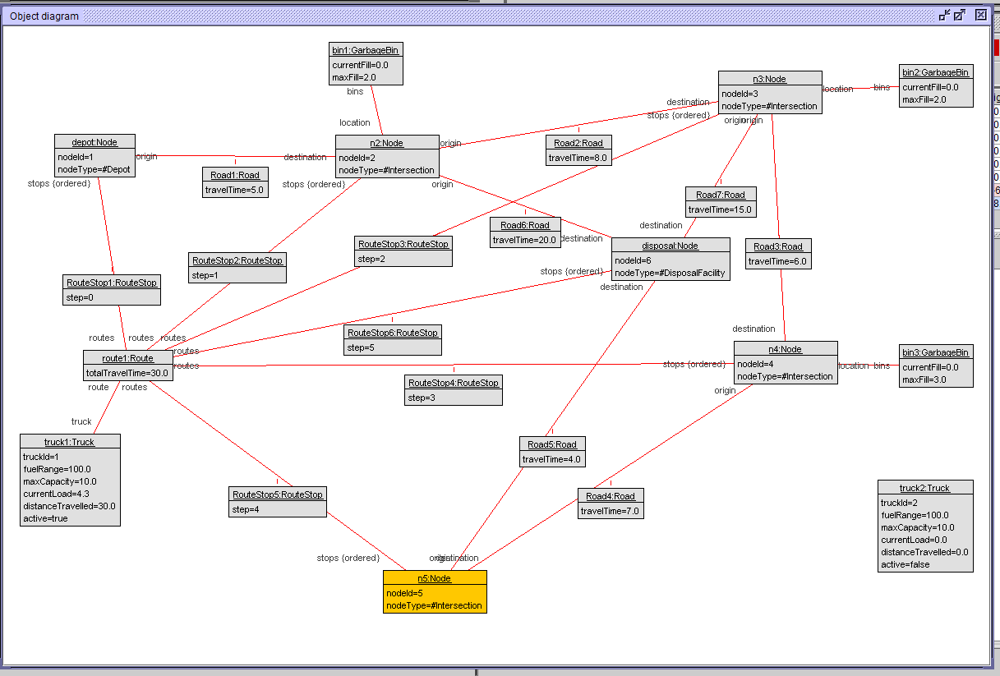
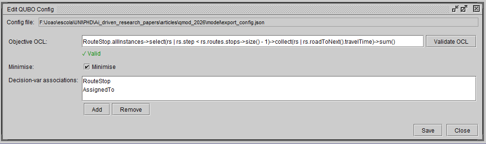
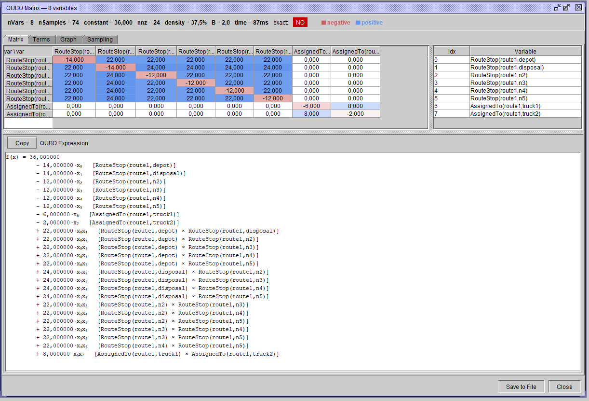

# USE2QUBO Plugin

[](https://github.com/JoaoAlmeida-dev/Use2Qubo/actions/workflows/ci.yml)
[](https://github.com/JoaoAlmeida-dev/Use2Qubo/actions/workflows/release.yml)

A USE OCL plugin that derives a QUBO formulation from OCL constraints, supporting a model-driven quantum optimisation pipeline.

Versioned release jars: see [Releases](https://github.com/JoaoAlmeida-dev/Use2Qubo/releases). Commit convention for contributors: [CONTRIBUTING.md](CONTRIBUTING.md).

## Workflows

- **CI** (`ci.yml`) — builds and tests every push/PR (`mvn clean verify`), uploads jar artifact.
- **Commitlint** (`commitlint.yml`) — enforces conventional-commit messages on PRs to `main`.
- **Release** (`release.yml`) — on push to `main`, runs `semantic-release` to bump the version, tag, publish a GitHub release with the built jar.

## Features

| Action | Menu item | Status |
|--------|-----------|--------|
| Derive QUBO from OCL invariants | Plugins → Derive QUBO Matrix | Done |
| Edit `qubo_config.json` via form UI | Plugins → Edit QUBO Config | Done |

## How it works

1. **Model + constraints.** You load a `.use` model (classes, associations, OCL invariants) and an object diagram (a concrete system state) into USE, as usual.
2. **Decision variables.** `qubo_config.json` declares which associations are binary decision variables `x_i ∈ {0,1}` (link present/absent) and which OCL expression is the objective `c(x)`. `QuboContextBuilder` reads the live `MSystem` plus this config to build an immutable `QuboContext`: the variable index, the objective expression, and the invariants to encode as penalties.
3. **Sampling.** `QuboEngine` (AutoQUBO, Moraglio et al.) does not symbolically differentiate the OCL expression. Instead it evaluates `f(x) = c(x) + α·g(x)` — cost plus penalty-weighted constraint violations — on a small set of binary vectors (`2 + n·(n+1)` evaluations) via USE's real OCL evaluator, and fits a degree-2 polynomial `q(x)` to those samples. The penalty weight `α` is computed by the configured `penalty_method` (e.g. Verma & Lewis).
4. **Exactness check.** Because the fit only samples `f(x)`, it can be wrong if `f` isn't actually degree-2 (see [Exactness check](#exactness-check) below). The engine re-evaluates `f` on held-out random vectors and compares against `q(x)` to catch this before you trust the result.
5. **QUBO matrix.** The fitted coefficients become the `Q` matrix (`QuboResult`: constant, linear, quadratic terms), viewable in `QuboMatrixView` and exported to `qubo.json` (`QuboResultExporter`) for use by a QUBO/annealing solver.

## Examples

The [examples/](examples/) directory contains ready-to-load `.use` models with matching `qubo_config.json` files:

| Example | Description |
|---------|-------------|
| [examples/GarageTrucks/](examples/GarageTrucks/GarbageTruckRouting.use) | Garbage truck routing model; decision variables encode route/stop assignments, objective minimises total travel time. See [qubo_config_schema.md](examples/GarageTrucks/qubo_config_schema.md) for a full field-by-field reference of `qubo_config.json`. |
| [examples/autoquboMaxClique/](examples/autoquboMaxClique/MaxClique.use) | Max-clique model demonstrating AutoQUBO sampling on a classic combinatorial benchmark. |

Each example folder also ships a `.cmd` file with USE console commands to load the model and populate an initial object diagram, useful for a quick smoke test after installing the plugin.

### Example screenshots

**Class diagram** — a loaded `.use` model before deriving the QUBO matrix:



**Object diagram** — decision-variable instances populating the model:



**QUBO config editor** — "Edit QUBO Config" form UI for `qubo_config.json`:



**QUBO matrix view** — "Derive QUBO Matrix" result, colour-coded Q-matrix table:



## Configuration

Place `qubo_config.json` in the same directory as the `.use` model file. Required fields:

```json
{
  "decision_var_associations": ["RouteVisits", "AssignedTo"],
  "decision_vars": [
    {"type": "link", "association": "RouteVisits", "domain": ["Route", "Node"]},
    {"type": "link", "association": "AssignedTo",  "domain": ["Route", "Truck"]}
  ],
  "objective": {
    "expression": "Route.allInstances->collect(r | r.totalTravelTime)->sum()",
    "minimise": true
  }
}
```

- `decision_var_associations` — associations treated as binary decision variables; excluded from fixed links in the exported instance.
- `decision_vars` — ordered list of variable entries used to build the flat binary vector. Variable indices are assigned in list order; within each entry, (a, b) pairs are sorted lexicographically by object name.
- `objective` — OCL expression to optimise and direction (`minimise`/`maximise`).

## Source layout

```
src/main/java/org/tzi/use/plugin/use2qubo/
├── use2quboPlugin.java        — plugin entry point (USE registration)
├── action/
│   ├── DeriveQuboAction.java        — "Derive QUBO Matrix" async Swing action; opens QuboMatrixView
│   └── EditQuboConfigAction.java    — "Edit QUBO Config" Swing action; opens QuboConfigView
├── qubo/
│   ├── QuboConfig.java              — parses qubo_config.json for QUBO pipeline
│   ├── QuboConfigPaths.java         — resolves qubo_config.json path relative to loaded .use file
│   ├── DecisionVar.java             — decision-variable descriptor
│   ├── QuboContext.java             — immutable runtime context (model, state, invariants, var index)
│   ├── QuboContextBuilder.java      — builds QuboContext from live MSystem + config
│   ├── QuboEngine.java              — AutoQUBO algorithm (Moraglio et al.); derives Q-matrix via OCL sampling
│   ├── QuboResult.java              — immutable result (constant, linear, quadratic coefficients)
│   └── QuboResultExporter.java      — writes QuboResult → qubo.json
├── ui/
│   ├── QuboMatrixView.java          — colour-coded Q-matrix JTable in dockable internal window
│   ├── QuboConfigView.java          — form editor for qubo_config.json in dockable internal window
│   └── QuboGraphPanel.java          — QUBO expression graph visualiser panel (JAVA-010)
└── util/
    ├── PluginLog.java               — wires logging to USE log panel (info/warn/error/debug)
    └── SimpleJsonWriter.java        — minimal JSON serialiser (no external deps)
```

## CLI

`QuboCli` runs the same derive pipeline headlessly, no USE GUI required — useful for CI, scripting, or batch-deriving multiple examples.

```bash
java -cp "target/use2qubo-1.0.0.jar;lib/*" org.tzi.use.plugin.use2qubo.cli.QuboCli \
  --model examples/GarageTrucks/GarbageTruckRouting.use \
  --cmd   examples/GarageTrucks/GarbageTruckRouting.cmd \
  [--config qubo_config.json] \
  [--out qubo.json]
```

(On Linux/macOS, use `:` instead of `;` in `-cp`.)

- `--model` (required) — path to the `.use` model file.
- `--cmd` (required) — `.cmd` script of `!`-prefixed SOIL statements, executed against a fresh `MSystem` built from the model, to populate the object diagram before deriving.
- `--config` (optional) — path to `qubo_config.json`. Defaults to `qubo_config.json` next to the model file.
- `--out` (optional) — path to write the derived `qubo.json`. Defaults to `qubo.json` next to the model file.

Prints a one-line summary to stdout: `nVars=<n> exact=PASS|FAIL derivationMs=<ms> out=<path>`. Progress and warnings go to stderr.

**Exit codes:**

| Code | Meaning |
|------|---------|
| `0` | QUBO derived, exactness check passed |
| `1` | Unexpected error (bad model/cmd file, IO failure, etc.) |
| `2` | Usage error (missing/unknown argument) — prints usage to stderr |
| `3` | QUBO derived but exactness check failed — inspect `qubo.json`'s `exact`/`polyDegree`/`nAncillaVars` fields and see [Exactness check](#exactness-check) below |

## Exactness check

`QuboEngine.derive()` fits the QUBO polynomial q(x) from a limited set of sample points (AutoQUBO's data-driven sampling, `2 + n*(n+1)` evaluations). Fitting is exact by construction on those training points, but the true objective+penalty function f(x) is only degree-2 representable if:

1. every OCL invariant contributes an integer violation count rather than a boolean pass/fail, and
2. no term in the objective or a violation count depends on 3 or more decision variables at once.

If either assumption is violated, q(x) matches f(x) on the training points but diverges elsewhere, and the fit is silently wrong. The exactness check catches this by testing q(x) against a fresh evaluation of f(x) on points the fit never saw.

**How it works** (`QuboEngine.checkExactness`, `ExactnessPoint`):

- Generates up to 20 random binary vectors (fixed seed `7919`, for reproducible results across runs).
- Skips vectors with Hamming weight < 3 — those are the training samples used to fit q(x), so they'd trivially "pass".
- Retries (capped at `max(200, n²·20)` attempts) until enough qualifying vectors are found, or gives up for very small n where too few exist.
- For each held-out vector x, computes q(x) from the fitted coefficients and f(x) by re-running the real OCL evaluator, then records the absolute error `|f(x) - q(x)|`.
- `QuboResult.exact` is `true` only if every point evaluated successfully and every error is below `EPS`.

**On failure**, a warning is logged with the two likely causes above (see `QuboEngine`'s class-level Javadoc for the reformulation guidance). Results are shown as a pass/fail badge in `QuboMatrixView` and as a full per-point error table in the "Sampling" tab (`SamplingTabPanel`), and are included in the exported `qubo.json` (`exact` field, `QuboResultExporter`).

## Ticket tracker

| Ticket | Description | Status |
|--------|-------------|--------|
| [JAVA-001](tickets/JAVA-001-model-state-reader.md) | Model & state reader → `QuboContext` | Done |
| [JAVA-002](tickets/JAVA-002-qubo-engine.md) | OCL evaluator + Q-matrix deriver | Done |
| [JAVA-003](tickets/JAVA-003-qubo-output.md) | Write `qubo.json` | Done |
| [JAVA-004](tickets/JAVA-004-plugin-action.md) | "Derive QUBO Matrix" Swing action | Done |
| [JAVA-005](tickets/JAVA-005-qubo-visualiser.md) | Q-matrix visualiser (`QuboMatrixView`) | Done |
| [JAVA-006](tickets/JAVA-006-config-editor.md) | QUBO config form editor (`QuboConfigView`) | Done |
| [JAVA-007](tickets/JAVA-007-qubo-engine-v2-improvements.md) | `QuboEngine` AutoQUBO v2 improvements | In progress |
| [JAVA-008](tickets/JAVA-008-dialog-to-internal-windows.md) | Convert popup dialogs to dockable internal windows | Done |
| [JAVA-009](tickets/JAVA-009-ui-understandability-improvements.md) | UI understandability & visualisation improvements | Done |
| [JAVA-010](tickets/JAVA-010-qubo-expression-visualisation.md) | QUBO expression graph visualiser (`QuboGraphPanel`) | Done |
| [JAVA-013](tickets/JAVA-013-headless-cli.md) | Headless CLI: derive QUBO without USE GUI | Done |

## Prerequisites

- Java 11+
- Maven 3.6+
- A checkout of [useocl/use](https://github.com/useocl/use) (USE OCL, version 7.5.0), used to obtain the `use-core` and `use-gui` JARs and, optionally, the `use-assembly` module for building a redistributable USE bundle with the plugin included

## Building

### 1. Get the USE JARs

This plugin depends on `use-core` and `use-gui`, which are not published to Maven Central. Build them from the USE repo and copy them into `lib/`:

```bash
git clone https://github.com/useocl/use.git
cd use
mvn package -pl use-core -pl use-gui
```

Then copy the resulting JARs (or the ones from an existing USE installation's `lib/` directory) into this plugin's `lib/`. See [lib/README.md](lib/README.md) for exact filenames.

### 2. Build the plugin JAR

```bash
mvn clean package
```

Output: `target/use2qubo-1.0.0.jar`

### 3. (Optional) Bundle into a USE distribution

To produce a redistributable USE ZIP with the plugin pre-installed, copy `target/use2qubo-1.0.0.jar` into `<use-repo>/use-assembly/src/main/resources/plugins/`, then run `mvn package -DskipTests` inside `<use-repo>/use-assembly/`. The resulting `use-7.5.0-use-bin.zip` will include this plugin.

## Installation

Copy `use2qubo-1.0.0.jar` into the `plugins/` directory of your USE installation, then restart USE. The plugin registers itself automatically via `useplugin.xml`.
