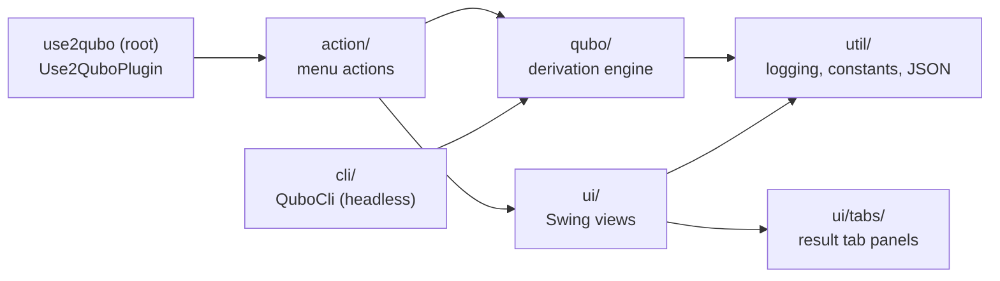

# `use2qubo` (root package)

Plugin entry point. Holds `Use2QuboPlugin`, the `IPlugin` USE calls on startup so the
plugin registers cleanly (no diagram-manipulator NPE) even though it contributes no
diagram extensions — just two menu actions (see [`action/`](action/README.md)).

All real work lives in the sibling packages:

See [`qubo/README.md`](qubo/README.md) for the actual derive-QUBO pipeline.
