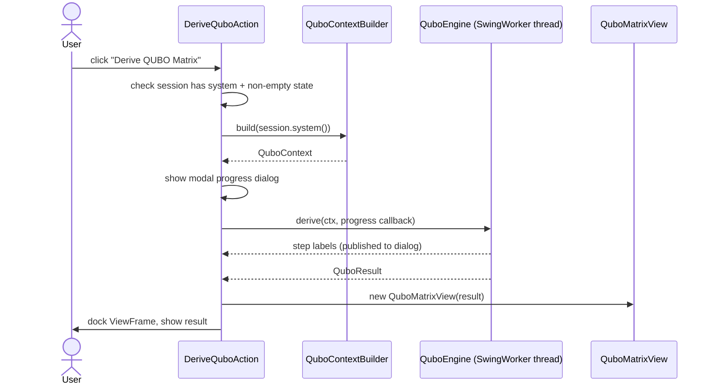
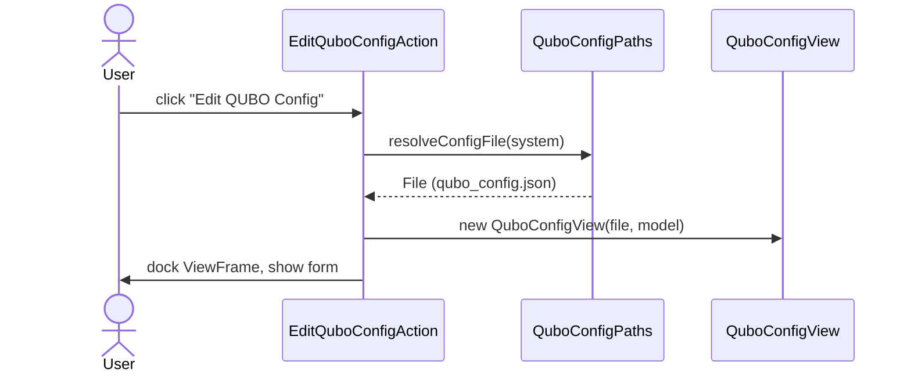

# `action`

The two USE menu commands the plugin registers (`src/main/resources/useplugin.xml`).
Both delegate to `qubo/` for logic and `ui/` for display; this package is pure
Swing/USE-runtime glue, no derivation or parsing logic of its own.

| Class | Menu item | Does |
|---|---|---|
| `DeriveQuboAction` | "Derive QUBO Matrix" | Builds a `QuboContext`, runs `QuboEngine.derive` off the EDT with a cancellable progress dialog, opens the result in `QuboMatrixView`. |
| `EditQuboConfigAction` | "Edit QUBO Config" | Resolves `qubo_config.json` next to the loaded model, opens it in `QuboConfigView`. |

Both require a loaded model (`shouldBeEnabled` checks `session.hasSystem()`); `DeriveQuboAction`
additionally aborts with a warning dialog if the system state is empty (no `.cmd` script run yet).

