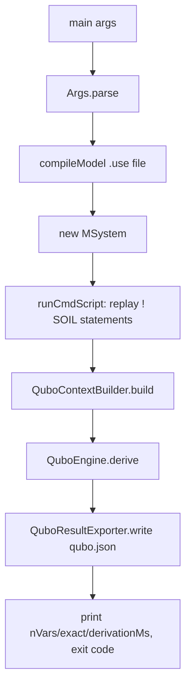

# `cli`

Headless entry point (`QuboCli`) for the same derive-QUBO pipeline `action/DeriveQuboAction`
runs interactively, minus the Swing UI. Used by experiment scripts and CI to compile a `.use`
model, replay a `.cmd` scenario, and emit `qubo.json` from the command line. See
`tickets/JAVA-013-headless-cli.md` for the original design note.

```
use2qubo-cli --model <model.use> --cmd <script.cmd> [--config <qubo_config.json>] [--out <qubo.json>]
```

Exit codes: `0` = derived and exact, `3` = derived but exactness check failed (still writes
`qubo.json`), `1` = pipeline error, `2` = usage error.



Shares `qubo/` and `util/` verbatim with the GUI path (`QuboContextBuilder`, `QuboEngine`,
`QuboResultExporter`, `PluginLog`) so headless and interactive runs of the same model/config
produce byte-identical `qubo.json`.
