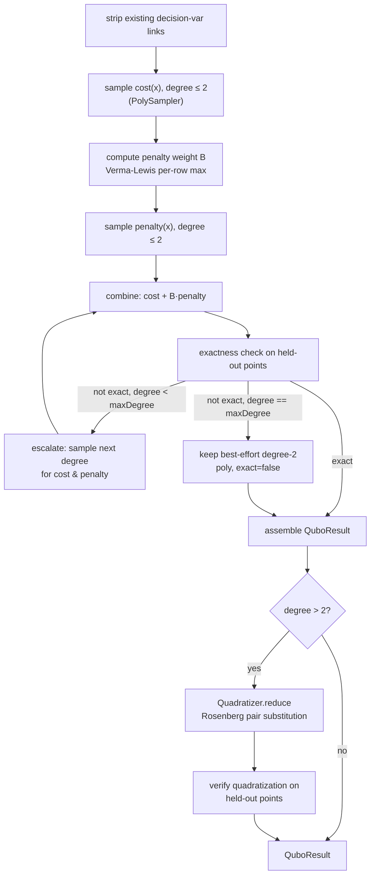

# `qubo`

Core package: turns a USE model + live object state + `qubo_config.json` into a QUBO
Q-matrix. No Swing, no CLI-specific code — `action/DeriveQuboAction` and `cli/QuboCli` both
call straight into this package tree and share every class in it.

Split into four subpackages that mirror the derivation pipeline stages below; see each one's
own README for its class map:

- [`config/`](config/README.md) — parses `qubo_config.json`. No dependency on the others.
- [`context/`](context/README.md) — builds a `QuboContext` snapshot. Depends on `config`.
- [`result/`](result/README.md) — output data models + JSON exporter. No dependency on `context`/`engine`.
- [`engine/`](engine/README.md) — the derivation algorithm. Depends on `context` and `result`.

Dependency direction: `config ← context ← engine`, `result ← engine`. No cycles.

## Objective

Given:
- a set of **decision variables** (binary, one per candidate association link),
- an **objective** OCL expression to minimise/maximise,
- the model's **class invariants** (each treated as a penalty: +1 per violated instance),

derive the coefficients of an equivalent quadratic pseudo-Boolean polynomial
`q(x) = c + Σ c_i·x_i + Σ c_ij·x_i·x_j` — the QUBO Q-matrix — using data-driven sampling
(AutoQUBO, no symbolic OCL differentiation needed), with degree escalation and Rosenberg
quadratization for objectives that aren't degree-2-exact.

## Derivation pipeline (`QuboEngine.derive`)

Key design points, each documented in more depth on the relevant class's Javadoc:

- **Two-pass sampling** (`cost`, `penalty`) so the Verma-Lewis penalty weight `B` can be
  derived from cost coefficients alone (tighter than a global-sum bound).
- **Degree escalation**: starts at degree 2; if the combined polynomial fails the
  held-out exactness check, resamples at degree 3, 4, ... up to `QuboContext.maxDegree`.
- **Quadratization** (`Quadratizer`): any degree > 2 polynomial is reduced to an exact
  QUBO by introducing ancilla variables (Rosenberg 1975), verified against the same
  held-out points used for the exactness check.
- **Exactness check**: `q(x)` vs. true `f(x) = cost(x) + B·penalty(x)` on random held-out
  binary vectors, reported per-point in `QuboResult.exactnessPoints` for UI diagnostics.

See `articles/qmod_2026/sections/04-approach.tex` for the paper-level description of this
pipeline, and the project `CLAUDE.md` "Scope Limits" section for known exactness caveats
(boolean pass/fail invariants, hinge penalties) that this package cannot resolve automatically.
