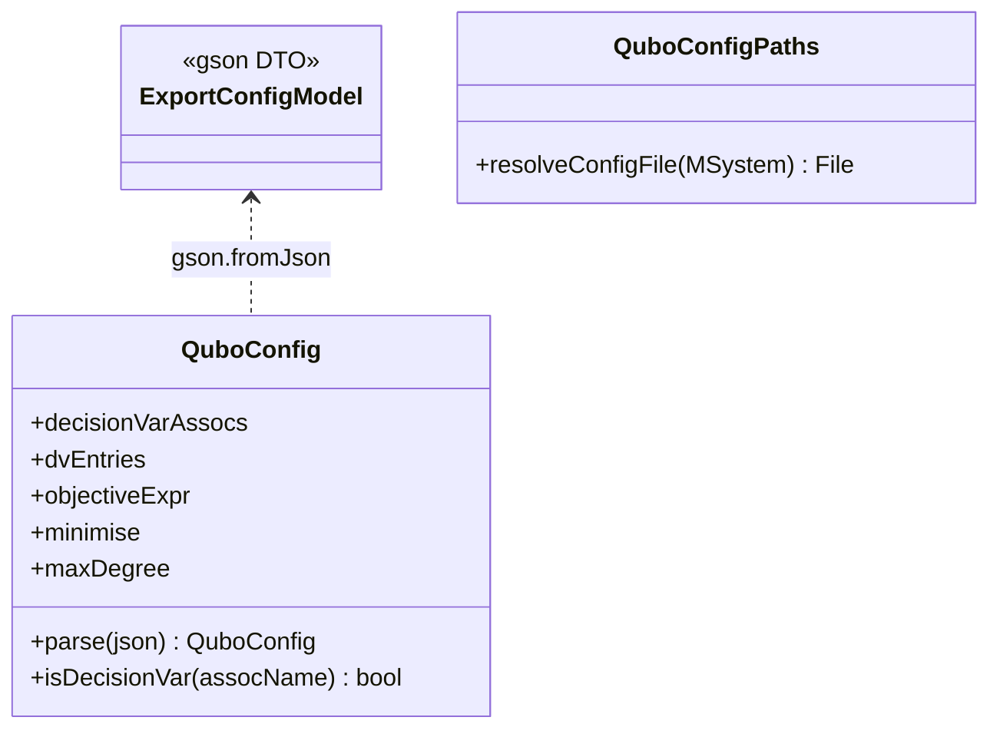

# `qubo.config`

Parses `qubo_config.json`. No dependency on `qubo.context`, `qubo.result`, or `qubo.engine`.

| Class | Role |
|---|---|
| `ExportConfigModel` | Package-private Gson DTO mirroring the JSON structure verbatim. |
| `QuboConfig` | Typed config parsed from `ExportConfigModel`: decision-var associations, `dvEntries`, objective expression/direction, `maxDegree`. |
| `QuboConfigPaths` | Locates `qubo_config.json` next to the loaded `.use` model file. |

Consumed by `qubo.context.QuboContextBuilder` (`QuboConfig`, `QuboConfigPaths`), `ui.QuboConfigView`
(`QuboConfig`), and `action.EditQuboConfigAction` (`QuboConfigPaths`).
