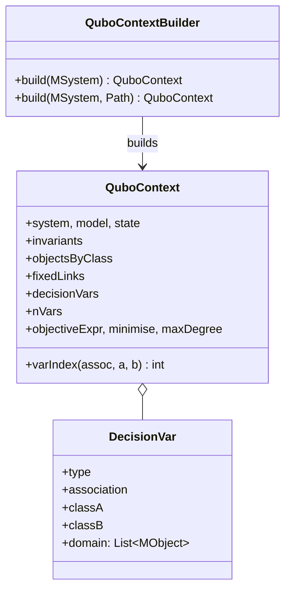

# `qubo.context`

Builds an immutable snapshot of the live USE model/state plus decision variables, ready for
`qubo.engine.QuboEngine` to derive a QUBO from. Depends on `qubo.config`.

| Class | Role |
|---|---|
| `DecisionVar` | One `decision_vars` entry: a binary decision-variable family x_{a,b} with its classA domain. |
| `QuboContext` | Immutable snapshot: model, state, invariants, objects-by-class, fixed links, decision vars, `nVars`, objective. Exposes `varIndex(assoc, a, b)` for the flat binary-vector ordering. |
| `QuboContextBuilder` | Resolves/parses `qubo_config.json` (via `qubo.config`), snapshots objects/links from a live `MSystem`, computes `nVars`, assembles `QuboContext`. |

Consumed by `qubo.engine.QuboEngine` (`QuboContext`, `DecisionVar`) and both pipeline entry points,
`action.DeriveQuboAction` and `cli.QuboCli` (`QuboContext`, `QuboContextBuilder`).
