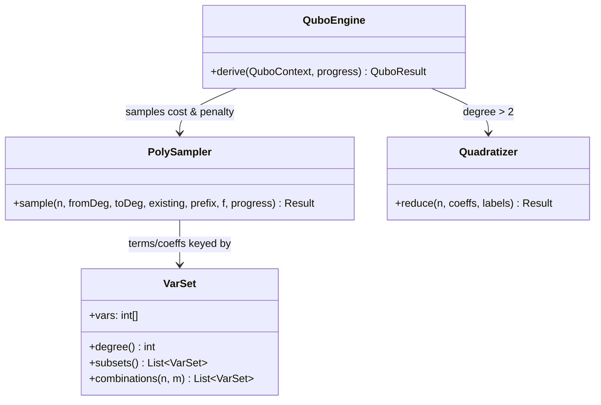

# `qubo.engine`

The QUBO derivation algorithm: sampling, degree escalation, and quadratization. Depends on
`qubo.context` (consumes `QuboContext`/`DecisionVar`) and `qubo.result` (builds
`SampleRecord`/`ExactnessPoint`/`QuboResult`).

| Class | Role |
|---|---|
| `VarSet` | Immutable sorted set of variable indices; the polynomial-term key (constant/linear/quadratic/higher-order), with subset enumeration and combinatorics helpers. |
| `PolySampler` | Generalised AutoQUBO sampling (Moraglio et al., GECCO '22): samples a black-box function at m-hot vectors and recovers exact pseudo-Boolean coefficients by inclusion-exclusion. |
| `Quadratizer` | Reduces a degree>2 polynomial to an exact QUBO via Rosenberg pair-substitution quadratization, introducing ancilla variables. |
| `QuboEngine` | Orchestrator: two-pass (cost/penalty) sampling, Verma-Lewis penalty weight, degree escalation on exactness failure, quadratization, result assembly. |

See the parent `qubo/README.md` for the full `QuboEngine.derive` pipeline flowchart. Consumed
by `action.DeriveQuboAction` and `cli.QuboCli` (`QuboEngine` only — `PolySampler`/`Quadratizer`/
`VarSet` are internal to the derivation algorithm).
