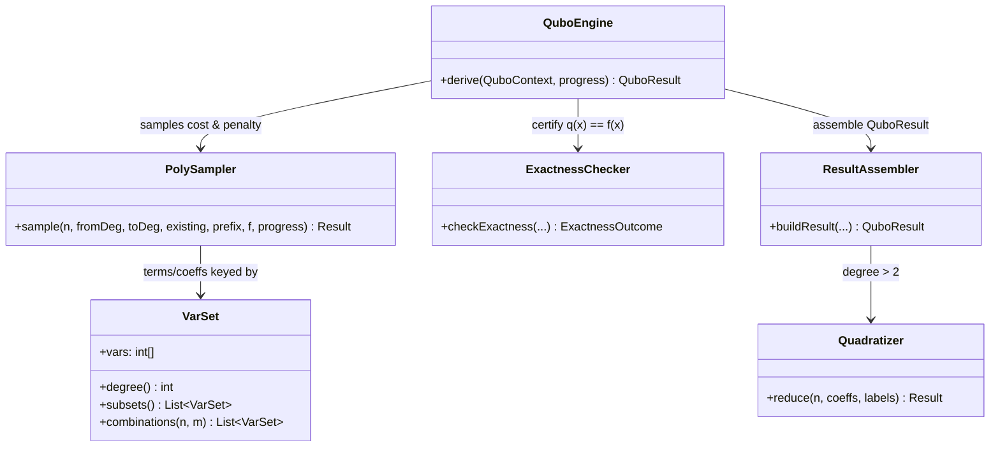

# `qubo.engine`

The QUBO derivation algorithm: sampling, degree escalation, and quadratization. Depends on
`qubo.context` (consumes `QuboContext`/`DecisionVar`) and `qubo.result` (builds
`SampleRecord`/`ExactnessPoint`/`QuboResult`).

`QuboEngine` only orchestrates; each concern lives in its own class, grouped into subpackages
by what they operate on:

| Package | Classes | Role |
|---|---|---|
| (root) | `QuboEngine` | Orchestrator: two-pass (cost/penalty) sampling, Verma-Lewis penalty weight, degree escalation on exactness failure, quadratization, result assembly. |
| (root) | `ProgressEvent` | Structured progress signal, threaded alongside the free-form `Consumer<String>` callback; carries `report`/`reportPhase` helpers used by every package below. |
| (root) | `Quadratizer` | Reduces a degree&gt;2 polynomial to an exact QUBO via Rosenberg pair-substitution, introducing ancilla variables. |
| (root) | `ResultAssembler` | Trims near-zero coefficients, quadratizes if needed, verifies the quadratization, and assembles the final `QuboResult`. |
| `index` | `DVPair`, `VarIndexBuilder` | The flat `(DecisionVar, objA, objB)` decision-variable index, and building the ordered list/labels that mirror `QuboContext.varIndex()`. |
| `eval` | `DecisionLinkSampler`, `ObjectiveEvaluator`, `PenaltyEvaluator` | Temporary decision-link insert/strip/restore against the sandboxed `MSystemState`, and OCL evaluation of the objective/penalty at a binary vector. |
| `sampling` | `VarSet`, `PolySampler`, `PolyMath` | The polynomial-term key type, generalised AutoQUBO sampling (Moraglio et al., GECCO '22), and pseudo-Boolean polynomial math (combine, evaluate, Verma-Lewis penalty weight). |
| `exactness` | `ExactnessChecker`, `ExactnessOutcome` | Certifies q(x) == f(x) — exhaustive proof up to `EXACTNESS_EXHAUSTIVE_MAX_N`, random held-out sampling above it. |

```mermaid
classDiagram
    class VarSet {
        +vars: int[]
        +degree() int
        +subsets() List~VarSet~
        +combinations(n, m) List~VarSet~
    }
    class PolySampler {
        +sample(n, fromDeg, toDeg, existing, prefix, f, progress) Result
    }
    class Quadratizer {
        +reduce(n, coeffs, labels) Result
    }
    class QuboEngine {
        +derive(QuboContext, progress) QuboResult
    }
    class ExactnessChecker {
        +checkExactness(...) ExactnessOutcome
    }
    class ResultAssembler {
        +buildResult(...) QuboResult
    }
    QuboEngine --> PolySampler : samples cost & penalty
    PolySampler --> VarSet : terms/coeffs keyed by
    QuboEngine --> ExactnessChecker : certify q(x) == f(x)
    QuboEngine --> ResultAssembler : assemble QuboResult
    ResultAssembler --> Quadratizer : degree > 2
```

See the parent `qubo/README.md` for the full `QuboEngine.derive` pipeline flowchart. Consumed
by `action.DeriveQuboAction` and `cli.QuboCli` (`QuboEngine` only — every other class here is
internal to the derivation algorithm, exposed as `public` only so the subpackages above can
reach each other, not as a stable external API).
