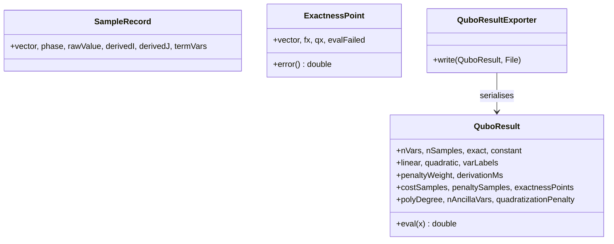

# `qubo.result`

Output-side data models plus the JSON exporter. No dependency on `qubo.context` or `qubo.engine`.

| Class | Role |
|---|---|
| `SampleRecord` | One raw OCL evaluation captured during AutoQUBO sampling (vector, phase label, raw value, derived matrix indices). |
| `ExactnessPoint` | One held-out evaluation point from the exactness check: true `f(x)` vs. QUBO approximation `q(x)`. |
| `QuboResult` | Immutable derived QUBO: polynomial (`linear`/`quadratic`/`constant`), diagnostics (`costSamples`, `penaltySamples`, `exactnessPoints`), ancilla/quadratization metadata. `eval(x)` evaluates the polynomial. |
| `QuboResultExporter` | Serialises a `QuboResult` to the `qubo.json` export format; sole writer of that format. |

Built by `qubo.engine` (`QuboEngine` assembles `QuboResult` from `SampleRecord`/`ExactnessPoint`
it produces via `PolySampler`) and rendered by `ui.QuboMatrixView` and its `ui.tabs` panels.
