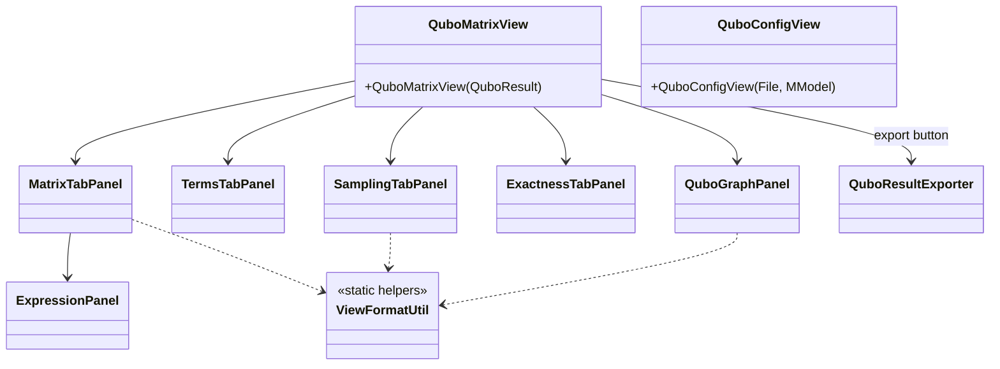

# `ui`

Swing views the two `action/` commands open. No derivation logic — everything here reads
an already-built `QuboResult`/`QuboConfig`/model and renders or edits it.

| Class | Role |
|---|---|
| `QuboMatrixView` | Top-level view for a `QuboResult`: stats header + `JTabbedPane` (delegates each tab to [`ui/tabs`](tabs/README.md)) + export-to-JSON button. |
| `QuboConfigView` | Editable form for `qubo_config.json`: objective OCL field (live-validated via `OCLCompiler`), minimise toggle, max-degree spinner, one checkbox per model association. |
| `ExpressionPanel` | Renders the QUBO polynomial as a readable algebraic expression string, with copy-to-clipboard. Used inside `MatrixTabPanel`. |
| `ViewFormatUtil` | Shared formatting/colour/label helpers (positive/negative coefficient colouring, table row filtering) used across `MatrixTabPanel`, `SamplingTabPanel`, `QuboGraphPanel`. |

Tab panels themselves live in [`ui/tabs/`](tabs/README.md).
