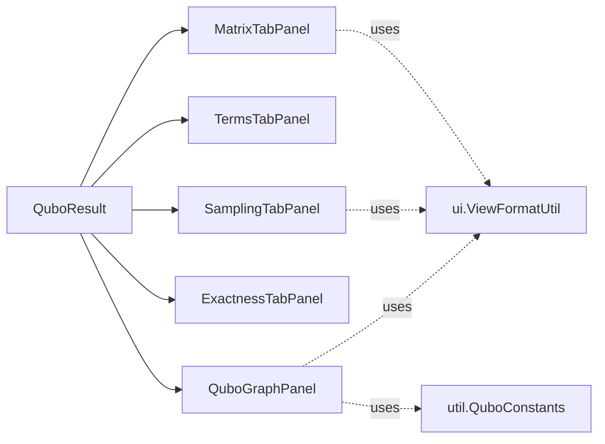

# `ui.tabs`

The five tabs shown inside `QuboMatrixView`'s `JTabbedPane`. Each takes a `QuboResult` (or a
slice of it) in its constructor and is otherwise self-contained.

| Tab | Class | Shows |
|---|---|---|
| Matrix | `MatrixTabPanel` | Colour-coded Q-matrix table (linear diagonal + quadratic off-diagonal), variable-label list, and the algebraic expression (`ExpressionPanel`). |
| Terms | `TermsTabPanel` | Flat table of every non-zero coefficient, sorted by \|coefficient\| descending. |
| Sampling | `SamplingTabPanel` | Raw `SampleRecord`s from both AutoQUBO passes (cost, penalty), with hover detail. |
| Exactness | `ExactnessTabPanel` | Held-out `ExactnessPoint` table: `f(x)` vs `q(x)` vs error, per point, colour-flagged on mismatch. |
| Graph | `QuboGraphPanel` | Node-per-variable / edge-per-quadratic-coefficient graph; edge colour = sign, thickness = magnitude; hover tooltips. |

All five are read-only renderers; the only mutation path in the whole plugin is
`QuboConfigView` (see [`ui/README.md`](../README.md)).
