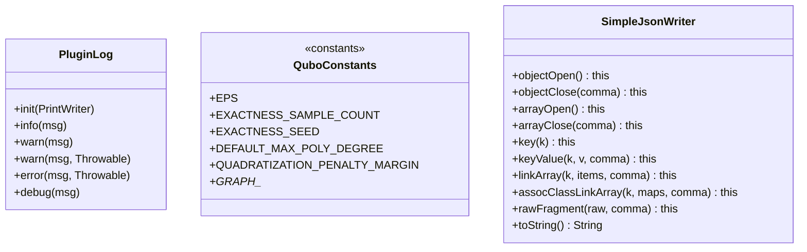

# `util`

Cross-cutting helpers with no QUBO-specific logic, used by both `qubo/` and `ui/`.

| Class | Role |
|---|---|
| `PluginLog` | Static logging facade: mirrors INFO+ messages to USE's log panel (`init(PrintWriter)`) and always to `java.util.logging`; same call sites work in the Swing plugin and the headless `cli.QuboCli`. |
| `QuboConstants` | Named constants (EPS, exactness-check sample count/seed/min-Hamming-weight, default max poly degree, quadratization penalty margin, graph node/edge sizing) — replaces what used to be inline magic numbers. |
| `SimpleJsonWriter` | Dependency-free JSON serializer covering exactly the structures `QuboResultExporter` needs (objects, arrays, association-class link arrays, raw-fragment injection). |

No class here depends on anything in `qubo/`, `ui/`, `action/`, or `cli/` — keep it that way.
